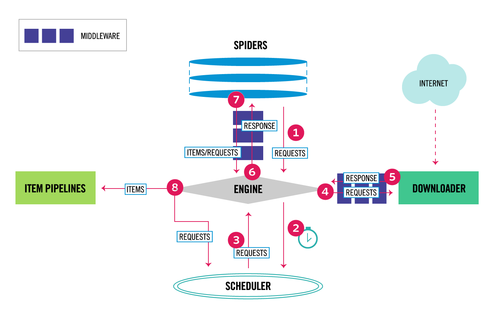

# KOIN BATCH 프로젝트

BATCH로 구동되는 작업을 모아둔 프로젝트입니다.

## 환경구성

프로젝트에 포함되어있는 run.sh 파일을 활용하여 프로젝트를 구동할 수 있습니다.

**사용 전 실행권한을 부여해주세요.**

```shell
chmod +x run.sh
chmod +x venv.sh
chmod +x pyproject.toml
```

> 사용예시

```shell
# 도움말 메시지
./run.sh -h

# 사용 가능한 크롤러 목록
./run.sh -l

# 크롤러(spider) 구동
./run.sh "city bus timetable"
```

## Crontab

Crontab을 활용하여 스케줄링을 구성할 수도 있습니다.

> 사용 예시

```shell
# city bus timetable batch
0 5 * * * bash ~/KOIN_BATCH/run.sh "city bus timetable" > /dev/null 2>&1
```

## env

[Poetry](https://python-poetry.org/)를 사용하여 가상 환경을 관리합니다.
프로젝트에 포함되어있는 venv.sh 파일을 활용하여 프로젝트를 구동할 수 있습니다.

*venv.sh에서 poetry가 설치되어 있지 않은 경우 설치합니다.  
따라서 직접 설치할 필요는 없습니다.*
```bash
# 선택 사항
pip install poetry
```

**사용 전 실행권한을 부여해주세요.**

```bash
chmod +x venv.sh
chmod +x pyproject.toml
```

> 사용 예시

```bash
# 가상 환경 생성
./venv.sh

# 가상 환경 활성화
poetry shell
```

## Scrapy

[Scrapy](https://scrapy.org/) 프레임워크를 사용하여 크롤러들을 관리합니다.  
scrapy는 가상 환경 내에 추가됩니다.

[공식 문서 바로가기](https://docs.scrapy.org/en/latest/)

> 사용 예시

```bash
# 사용 가능한 spider 목록 확인
# ./run.sh -l 동일
scrapy list

# 특정 spider 실행
# ./run.sh "city bus timetable"
scrapy crawl "city bus timetable"
```

### 프레임워크 구조

자세한 내용은 [공식 문서](https://docs.scrapy.org/en/latest/topics/architecture.html) 참고


